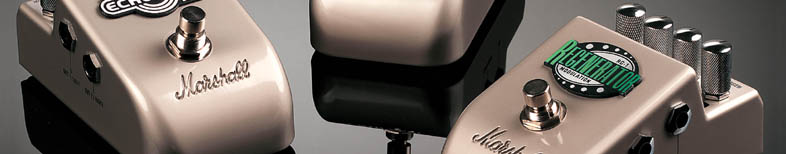

    

This repo is a description of common types of guitar pedals.

# Pedals

#### Tone Shaping

- [Distortion and Overdrive](#distortion-and-overdrive)
- [Fuzz](#fuzz)
- [Compressor](#compressor)
- [Wah](#wah)

#### Modulation Based & Other Effects

- [Vibrato](#vibrato)
- [Tremolo](#tremolo)
- [Chorus](#chorus)
- [Pitch Shifter](#pitch-shifter)
- [Harmonizer](#harmonizer)
- [Phaser](#phaser)
- [Flanger](#flanger)

#### Noise Gate

- [Noise Gate](#noise-reduction)

#### Time Based

- [Delay](#delay)
- [Reverb](#reverb)
- [Looper](#looper)

# [Distortion](https://youtu.be/VQXaCFr8ePU?t=92) and [Overdrive](https://youtu.be/VQXaCFr8ePU?t=72)

Distortion and overdrive pedals simulate the natural breakup from an overdriven amp. They are the essence of Rock, Blues and Heavy Metal. These pedals create the gritty, crunchy sounds that make the electric guitar worth listening to.  

### Difference between Distortion and Overdrive

__Distortion__ - A distortion pedal makes your guitar sounds very gritty. It adds a lot of sustain and _crunch_ to an otherwise bland guitar tone. Maximum distortion is used for Heavy Metal sounds, while a little distortion is used to add some character to a standard guitar tone.

__Overdrive__ - An overdrive pedal has a slightly more hollow sound than a distortion pedal. It sounds like a tube amp cranked to maximum output, adding some _buzz_ to your sound. High overdrive can create fat, throaty sounds, while subtle uses of overdrive are often used to create bluesy sounds.

The difference between these two pedals is very subtle. The best way to tell the two apart is to experiment!

### How Much Distortion/Overdrive is Best?

Distortion/Overdrive pedals have a knob with range usually from 0 to 10.

__0-3__: adds a little distortion to your tone. Useful for blues and rock rhythm guitar.

__3-8__: usually the optimum setting for the best tone. Set it closer to 8 for a gritty, crunchy, biting rock lead guitar sound.

__9-10__: this setting is for MAXIMUM DISTORTION and must be used with extreme care. Often, a setting of 9 or 10 is crucial for a menacing, evil, out-of-control heavy metal sound. However, careful guitar technique must be used to keep this sound under control.

### Playing Techniques

__Bridge pickup__ - when using distortion, always use the bridge pickup on your guitar (the pickup that is close to the bridge and furthest away from the neck). This will add maximum bite to your tone and let the distortion cut through. The neck pickup is seldom used.

__Muting__ - since distortion compresses the sound, more care must be taken to mute the strings you don't want to hear, as even slight vibrations will be amplified.

You can optionally set your distortion volume to be 10% higher than your clean volume.

# [Fuzz](https://youtu.be/VQXaCFr8ePU?t=125)

Fuzz pedals are extreme distortion pedals. They make a guitar sound fuzzy.

### Compared to distortion pedals

- Like a distortion pedal on 40 instead of 10.
- Higher bass & treble frequencies than distortion pedals.
- Much dirtier/rougher sound, that distortion/overdrive alone cannot produce.

# [Compressor](https://youtu.be/tH7T96MyxB4?t=134)

Compressors smooth out the dynamics of a guitar. The goal is to make all notes sound at a similar volume. For loud attacks, the volume is lowered. For soft attacks, the volume is increased.

### Compressors in Lead Guitar

Distortion pedals already automatically compress the signal, so a compressor may not be needed.

When a compressor is applied to a signal, soloing techniques such as hammer-ons, pull-offs, and tapping, which all usually have a lower volume than a picked note, are more easily heard.

### Compressors in Rhythm Guitar

A compressor helps achieve more accurate rhythm guitar playing. Each chord you play is at a slightly different volume. A compressor will make the dynamics more consistent.

### Compressors with Sustainers

Compressors usually have sustainers built into the same pedal.

Sustainers make the sound of your guitar ring out for as long as you wish, _even if the strings stop vibrating_. Sustaining sound is so important that every piano has a sustain pedal built into it (though the piano pedal works differently)

### Disadvantages

Compressing the volume is not always desirable. Guitars with a compressed volume sound more robotic.

# [Wah](https://youtu.be/qTbuDObjZoA?t=35)

Wah pedals boost certain frequencies of your guitar signal (alternating from low to high)

Wah pedals add a human characteristic to guitar tone. The pedal sounds similar to a human saying "Wahhh". This sound is also useful for having a guitar boost past the noise of drums, bass, and vocals when necessary.

### How to Use a Wah Pedal

A wah pedal is controlled by rocking your foot back and forth. Rocking your foot controls a sweeping peaking filter, which boosts whichever frequencies of your guitar that you choose.

Turning on a wah pedal immediately alters your tone since it will boost certain frequencies depending on the positioning of the foot pedal.

__Boosting Low Frequencies__ - put pressure on the pedal with the heel of your foot to rock the pedal back.

__Boosting High Frequencies__ - put pressure on the pedal with the front of your foot to depress it. If you already played a note or chord, this will make your guitar scream "Wahhhh"! Common usage is to then push again with the heel of the foot to return to boosting mid or lower frequencies.

One way to use the pedal is to rock your foot rhythmically to whatever rhythmic pattern or solo you are playing.

### Auto-wah

An auto-wah oesn't use the pedal to sweep across the frequencies, but instead works off of the sensitivity of the attacks (picking) to trigger the wah effect.

### Popular Use of the Wah Pedal

__Jimi Hendrix__ popularized the wah pedal in the late 1960s. Listen to [Voodoo Child](https://youtu.be/IZBlqcbpmxY) to get an idea of the sound of the wah pedal.

__Kirk Hammett__ (Metallica) uses the wah pedal on multiple guitar solos. Listen to the solos in the songs [The End of the Line](https://youtu.be/Hdil-F6B1gk) from the Death Magnetic album and [No Leaf Clover](https://youtu.be/PtiW6TgzhDA) from the S&M album to hear the unique, powerful sound created by a wah pedal.

__Tom Morello__ (AudioSlave, Rage Against the Machine) uses a wah pedal in multiple songs including [Bombtrack](https://youtu.be/MUaL1FnotRQ), [Guerrilla Radio](https://youtu.be/n6cBRx2Ie6A) and [Bulls on Parade](https://youtu.be/my6bfA14vMQ).

__John Frusciante__ (Red Hot Chili Peppers) used a wah pedal in the majority of his solos while on tour, including two of the popular songs [Californication](https://youtu.be/6L0LIo35sF4) and [Soul to Squeeze](https://youtu.be/0XcN12uVHeQ).

# [Vibrato](https://youtu.be/HTPdB3McWpQ)

Vibrato pedals are used to electronically add vibrato to single notes or chords. A natural vibrato done with the finger can only sharpen a note (since guitars are fretted), but a vibrato pedal can repeatedly sharpen and flatten a pitch.

### Speed and Depth Knobs

__A Speed Knob__ controls how fast the note's pitch is changed. Setting a high speed setting will simulate wiggling the finger against a note really fast.

__A Depth Knob__ controls how much a note's pitch is altered. Setting a high depth will create a dramatic vibrato that is often used in hard rock, heavy metal, and sometimes blues. Set a low depth for a more subtle vibrato effect.

When choosing a vibrato pedal, make sure that it contains these 2 essential knobs. Any other controls are just icing on the cake.

### Vibrato Pedal for Lead Guitar

While playing a solo, a guitarist usually chooses certain notes to add some vibrato to. These are usually the notes that are longer in duration. There is simply not enough time to add vibrato to the shorter notes. It is too physically demanding, and sometimes simply impossible, to add vibrato to every note. This is especially true if you are playing 16th notes at 160bpm (beats per minute) or faster.

A vibrato pedal can electronically accomplish adding vibrato to every note you play. No matter how fast you are playing your solo, each note will have a little vibrato added for a very interesting effect.

### Vibrato Pedal in Rhythm Guitar

Adding vibrato to chords, using your fingers, is difficult since you need to add it to 3-6 strings. It's basically impossible to accomplish on open chords. A vibrato pedal is useful here since it easily adds vibrato to all 6 strings.

Vibrato pedals can give standard rhythm parts or chord progressions much more character and appeal.

# [Tremolo](https://youtu.be/oOCNB1izw8A?t=33)

Tremolo pedals are used to create a pulsing of the volume of your guitar signal. The effect is similar to quickly raising and lowering the volume of your guitar using your guitar volume knob.

The tremolo sound is often confused with a fast vibrato. However, with tremolo, only the volume is quickly changing, while the pitch remains the same.

Tremolo is responsible for many subtle and sometimes strange guitar tones on recordings.  Many unique guitar sounds are created by slightly changing the controls of a Tremolo Pedal.

### Using a Tremolo Pedal

Tremolo pedals usually have two to four knobs available to tweek. The most common controls are listed below

__An Intensity Knob__ controls the amount of change to the volume. For example, let's say your guitar volume, on a scale of 1-10, is on 5. A low intensity will have your volume change from 4 to 6 repeatedly. A high intensity can have the guitar volume change from 2 to 8 repeatedly.

__A Speed Knob__ controls how fast the volume is raised and lowered. From our previous example, let's say that the tremolo is changing your guitar's volume from 4 to 6. Well, how long is the volume going to stay on 4 and how long is it going to stay on 6? This is determined with the _speed_ knob. Try setting the speed to the tempo of the song, or twice the tempo of the song.

__A Slope Knob__ is available on some tremolo pedals. It is somewhat of an extension of the _intensity_ knob. A _slope_ knob is determines how sharply the volume changes. Setting a high slope can create choppy helicopter sounds.  A low slope will yield more fluid volume changes.

__A Volume Knob__ controls the sound of your original guitar signal in relation to the pulsing tremolo signal. If you want the tremolo effect to fully replace your original guitar sound, set a very low volume knob.  If you want a tremolo effect that is subtle and low in volume, set the volume knob higher so that your original guitar sound rings out.

# [Chorus](https://youtu.be/zmN7fK3fKUE?t=41)

Chorus pedals are used to create a full, orchestral sound. The goal is to make one guitar sound like multiple copies of the same guitar.

### Orchestral sound

Whenever there are multiple singers singing in unison, or multiple strings playing the same melodic lines, there is always a slight variation in both time and pitch. This slight variation in time and pitch is what creates the full orchestral sound that is rich in tone. A chorus pedal uses delay to simulate this variation in time and uses modulation to simulate this variation in pitch.

### How it works

A chorus pedal separates an incoming guitar signals into 2 copies of the same signal.

1. One of these signals is unaltered, and is referred to as the _dry_ signal.
2. The second signal is altered and is referred to as the _wet_ signal. The "wet" signal is warbled in and out of tune.  A short delay is also added to the wet signal.  The altered wet signal is then combined with the original dry signal and sent to the amp. The resulting chorus effect is that your guitar will sound like multiple guitars playing in unison.

### Rate and Depth Knobs

_Pitch_ and _time_ are the two characteristics of your guitar signal that a chorus pedal alters.

__Rate Knob__ - controls the time delay of wet signal. Increase the rate to create a more dramatic delayed effect.

__Depth Knob__ - controls the modulation of the wet signal. Increase the depth to create a more dramatic modulation effect.

The more that you increase the rate and depth knobs, the fuller your guitar will sound.

# [Pitch Shifter](https://youtu.be/wHh1LfoeypM?t=58)

Pitch shifters are used to alter the pitch of a guitar. They take a single pitch, and shift it by an amount, such an octave, up or down.

They are usually controlled by a rocking foot pedal.

# [Harmonizer](https://youtu.be/wHh1LfoeypM?t=114)

Harmonizers _fatten_ a guitar sound by providing an additional 1-3 more voices in harmony, such as octaves, 4ths, 5ths, etc.

Harmonizers are often built into the same pedal as a pitch shifters

# [Phaser](https://youtu.be/0T_L4qYRi7s?t=37)

Phasers create a repeating _whooshing_ sound similar to the sound of a jet airplane as it flies by. A phaser can be set to sound like a subtle whoosh to complete a guitar tone, or a dramatic cycling jet airplane sonic effect.

### How do Phasers Work?

A phaser splits a guitar signal into 2 separate signals. The original signal is called the _dry_ signal, and the signal that is going to be altered is called the _wet_ signal. The dry signal remains unaltered. The wet signal is shifted out of phase with the dry signal by anywhere from 0 to 360 degrees of the full range of the frequency spectrum.

Next, the dry and wet signals are combined and sent to the guitar amp. What we hear out of the amp is the combined in-phase and out-of-phase relationship of the combined dry and wet signals. The in-phase and out-of-phase signals create the characteristic swirling, spacey sound that we now know of as a phased sound.

### Oscillator

Each phaser has an oscillator that continually changes the amount (in degrees from 0 to 360) that the wet signal is out of phase with the dry signal.

### Speed Knob

The _speed_ or _rate_ knob controls the speed of the oscillator (which shifts the out-of-phase signal). Increasing the speed will increase how fast the repetitions of the _whoosh_ sound are heard.

# [Flanger](https://youtu.be/NAqQvs_WXs8?t=23)

Flangers are like phasers, but much more dramatic.

Flangers create a deep cycling _whooshing_ sound, similar to when a plane takes off from a runway. The gut-wrenching sonic effects flangers create remain unparalleled and must be heard live to be truly appreciated. In 1966, the Beatles famous album _Revolver_ had every recorded song feature a flanger. In fact, it was John Lennon of the Beatles that named the popular effect "flanging".

### Additional Feedback Knob

Flangers are like phasers with a feedback knob. For flangers, the wet signal is fed back to itself multiple times (which is controlled by the _feedback_ knob). That means the out-of-phase signal is continuously shifted in and out of phase, which is what makes flangers sound much more powerful than phasers.

# [Noise Gate](https://youtu.be/mVTgIKaOCWQ?t=46)

A noise gate pedal removes all sound below a certain threshold. It is tricky to set, as you don't want it removing the tail end of your long notes.

# [Reverb](https://youtu.be/TZG2K0J_A3c?t=58)

Reverb pedals make a guitar sound _grander_ by adding sustain and echo, that can simulate playing in either a small room or a large concert hall. Reverb replicates the natural echo you would receive in such large venues. Without reverb, a guitar signal can sound short and dry.

Ever wonder why grand pianos are far more superior than upright pianos?  REVERB is the answer. Pianists often spend over $100,000 or more on a single grand piano that will create them the reverb they desire. In this case, the large size of the grand piano is necessary to create this reverb.

#### Reverb for Rhythm Guitar

A reverb pedal is crucial for clean and consistent rhythm guitar playing. It creates the necessary sustain to smoothly connect one chord to another. Without a reverb pedal, each chord of a rhythm guitar part will sound disconnected from every other chord, creating a very "choppy" sound.

Your fingers can only move so fast from one chord to another, and a reverb pedal is used to fill in the gaps by creating the necessary echo for a short period of time while you move from one chord to another.

#### Reverb for Lead Guitar

The same concepts apply to lead guitar as they do to rhythm guitar when applying reverb. The echo from the reverb pedal makes every lead guitar solo sound much smoother and fuller. It will ensure that each note of your solo is fluidly connected to any following note you play.

#### Reverb Knob

- 10% to 30% - needed for majority of situations.
- 30% or more - Makes your guitar sound _grand_. [Pink Floyd - Comfortably Numb](https://youtu.be/_FrOQC-zEog) uses distortion and high reverb to create a powerful and grand guitar tone.

#### Gated Reverb

A gated reverb closes off the end of the reverb tail at a given millisecond setting, and can yield some interesting percussive effects.

# [Delay](https://youtu.be/9LWRgA597O4?t=43)

A delay pedal (also called an _echo_ pedal) repeats the original sound of a guitar at a given time interval. It creates an echo from your guitar. This echo can be a slow echo, as you would hear in a big cave, or a fast echo that you would hear in a small room. The echo makes your guitar sound "richer" and "fuller".

### Selecting Delay Times

Delay times usually range from 30ms (very short) to 600ms (very long).  Most guitarists use delay times ranging from 100-200ms (milliseconds) to create the richest tone from their guitar. However, experimenting with short and long delay times can create that unique sound that you may need for that one special guitar solo.

__Short Delay Times__: 30 to 85ms (milliseconds). Short delay times are used to create the _slapback_ effect, usually present in country and rockabilly tunes. In rock, short delay times can be used for an interesting solo that will make your guitar sound like a completely different instrument.

__Long Delay Times__: 200 to 300ms (milliseconds). Longer delay times make a guitar sound much fuller. When using longer delay times, the guitarist must be careful that the longer repeats do not interfere with other instruments.

Most delay pedals have a knob that alters the delay time.

### Delay tricks

You can sound like you're playing 16th notes, while only playing 8th notes. Physically play 8th notes, but adjust your delay pedal properly (based on the tempo of the song) so that it plays exactly in between your 8th notes (so that it sounds like 16th notes)

# [Looper](https://youtu.be/EPYYNzFkl9Q?t=32)

Loopers (also called samplers) are used to capture a musical phrase and continuously repeat it. They can be used to layer multiple guitar parts over a looped rhythm track. You can create several layers of melody and rhythm during a live performance with the use of only one guitar.

### How it Works

A looper simply records what is played and repeats it. As the recorded track repeats, you are free to play anything else you wish over the recorded track. Multiple tracks can be layered to create a full, harmonicly-rich sound.

### Solo Artists

Loopers are usually used for one-man bands when an artist is in need of more layers of instruments. A typical solo singer/guitarist can have a looper as his or her replacement for a full band.

There is no true replacement for a live band of four or five musicians. However, a looper can replicate many of the qualities of a band. Experiment with a Looper Pedal. As more and more tracks are layered on top of each other, the sound of a full band is steadily achieved as all the layered tracks weave in and out of each other.

### Looping a Rhythm Guitar Part

The most common use of a looper is to loop chords or some sort of rhythmic groove. At a live performance, a guitarist will turn the looper on by stepping on the pedal and starting to play a rhythmic pattern that will be the foundation of his or her song. The looper will be recording the pattern in real-time as it is being played.

By stepping on the pedal again, the looper will continuously repeat the rhythmic pattern. Now, the guitarist is free to play something new on the guitar with the rhythmic pattern as backup. The guitarist can add a solo to the rhythmic part or even focus on singing over the rhythm. Another rhythm part can even be layered on top of the original track.

### Looping a Drum Part

A guitar cannot replicate the exact sound of a snare or symbol. However, it can keep time and create a percussive sound. This can be done by _palm muting_. Create a nice 8th note or 16th note rhythmic figure, one or two bars in length. Use the looper to record it, and layer the track on top of the previously recorded rhythm guitar pattern.

The advantage of using a looper as substitute for a drummer is that a looper has perfect time! A looper will provide consistency that can only be created digitally.
